# PARAMOUNT PORTAL

**One team. One front door.**

A mobile-first athlete and team platform for Paramount Barbell Club, designed to combine the athlete experience, coaching information, competition history, records, qualifications, training PRs, membership context, and team analytics in one interface.

**Design review:** the PWA shell, design, navigation, and Records In Reach presentation are built. Values shown below are controlled review/demo fixtures. Live Airtable/API integration and authentication are not connected.

## The mobile experience

| Home · the club front door | The Platform · the athlete hub |
| :---: | :---: |
| 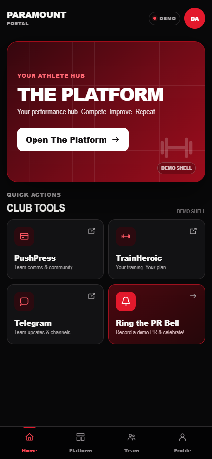 | 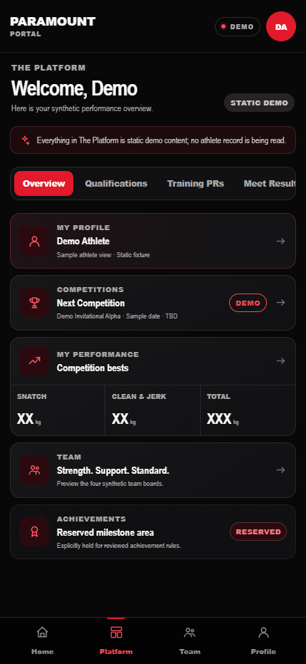 |

## What makes it different

The Portal goes beyond browsing USAW records. It is **federation/source-aware and club-centered**: the underlying data system reconciles multiple authoritative sources into a controlled athlete and team model, retaining the context needed to interpret results, qualifications, and records.

That model brings competition evidence together with training, membership context, and club priorities. The Portal is the athlete-facing experience being built on top of it.

## Athlete experience

| Area | Experience represented in the design |
| --- | --- |
| Personal profile | An athlete snapshot with competition bests, next competition, and meet history. |
| Training PRs | A dedicated view of personal bests across training movements. |
| Qualifications and record matches | Places to follow qualification progress and compare performance with relevant records. |
| Club tools | PushPress, TrainHeroic, and Telegram launchers for membership/community, training, and team communication. Destinations remain placeholders in this preview. |
| Ring the PR Bell | A workflow concept for recording and celebrating a training PR. The shell action does not save or submit a record. |

These screens demonstrate the intended experience using sample content; they do not read athlete records or verify eligibility.

## Team experience

Four boards give the team its own space:

| Board | Purpose and status |
| --- | --- |
| **Current Records** | A synthetic preview of club record holders. |
| **Perfect 6/6** | A sample board recognizing perfect meets. |
| **Bomb Squad** | A reserved board for a team tradition; its final rules and live membership are not represented here. |
| **Records In Reach** | A built presentation for verified holder evidence, athlete-facing opportunities, selected coach-only Near results, and cautious Needs Data / Review states. Values remain review/demo fixtures. |

| Team · all four boards | Profile · the athlete snapshot |
| :---: | :---: |
| 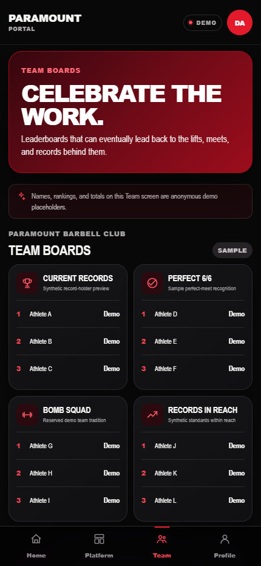 | 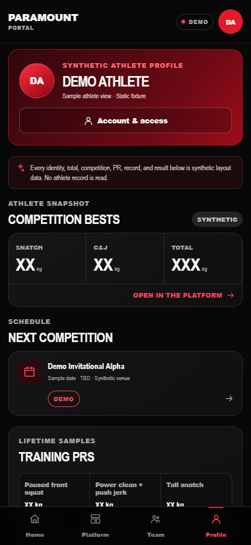 |

## Records In Reach review

The presentation layer is now built. Athlete profiles show only verified **Holds Record** and athlete-facing **In Reach** results. The coach board additionally surfaces one selected **Near** result per lift and separates cautious **Needs Data / Review** states from athlete-facing opportunities.

| Full coach board · desktop | Full coach board · mobile |
| :---: | :---: |
| 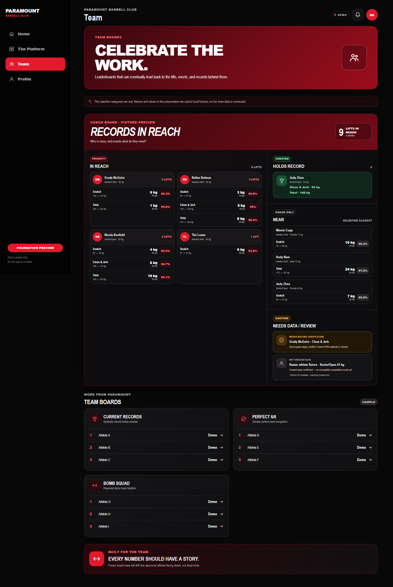 | 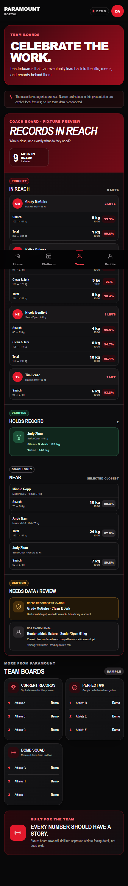 |

### Athlete-facing states

| Multiple In Reach results | Verified holder | No current opportunity |
| :---: | :---: | :---: |
| 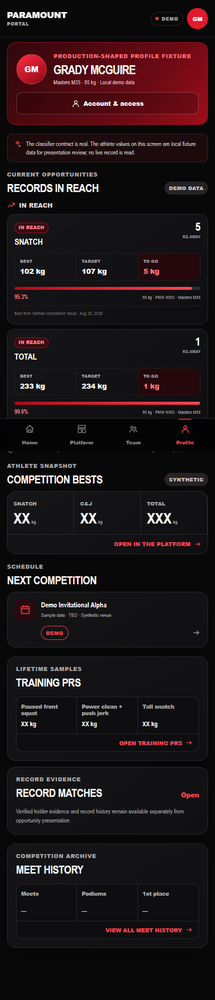 | 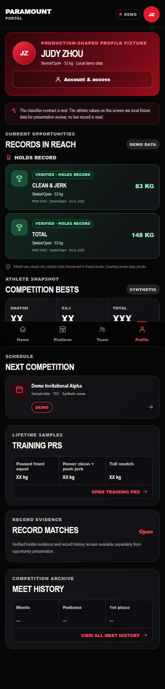 | 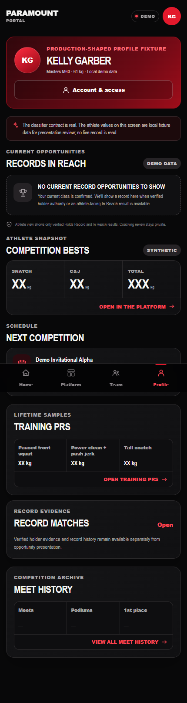 |

### Coach-only review detail

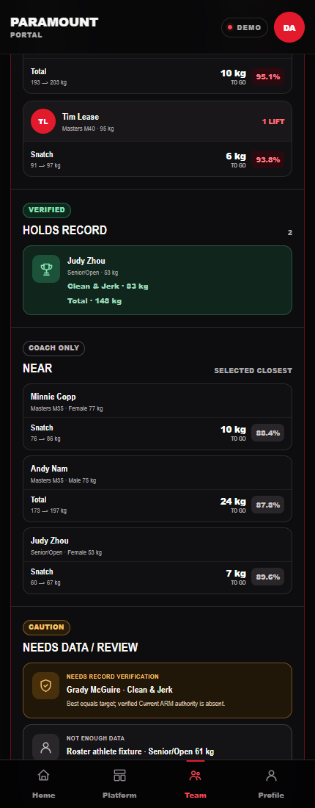

The screenshots use production-shaped review fixtures to validate hierarchy, language, responsive behavior, and category separation. They are not a live athlete-data feed. The review site does not connect to Airtable or an API, and authentication is not enabled.

## System architecture

The Portal belongs to a larger integrated data system. This diagram shows the conceptual path, including the planned live-data connection:

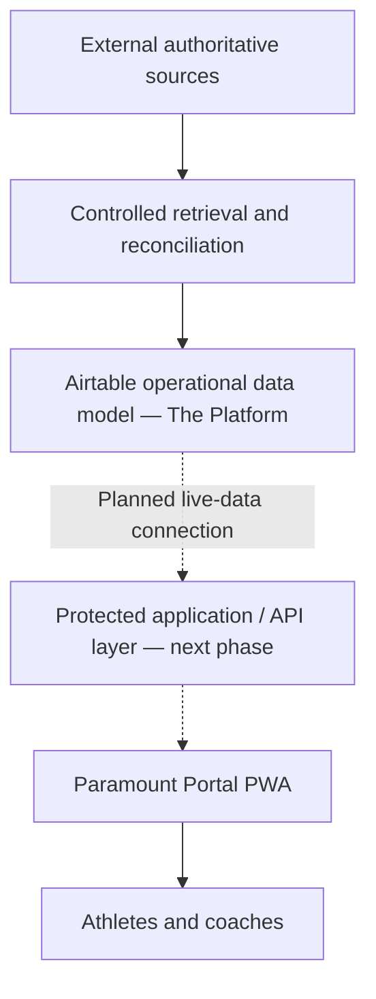

**Airtable** supports the operational model. **Cloudflare** provides the runtime and hosting foundation. **GitHub** supports reviewable engineering changes and automated validation. **ChatGPT** supports analysis and orchestration, with **Codex** supporting implementation and testing.

The built PWA currently uses static demo content. Read the [concise architecture overview](docs/architecture.md) for the responsibilities of each layer.

## Data integrity and engineering

- **Reconciled evidence:** source information is checked and reconciled before it informs athlete and team data.
- **Reviewable changes:** important updates can be inspected, with production writes intentionally controlled and validated.
- **Fail-closed decisions:** incomplete evidence is held back from downstream changes rather than treated as a complete result.
- **Automated protection:** tests and validation check structural integrity, security boundaries, and PWA behavior.
- **Private by design:** private athlete records and credentials are intentionally excluded from source control. This showcase contains documentation and synthetic screenshots only.

## One front door, room to grow

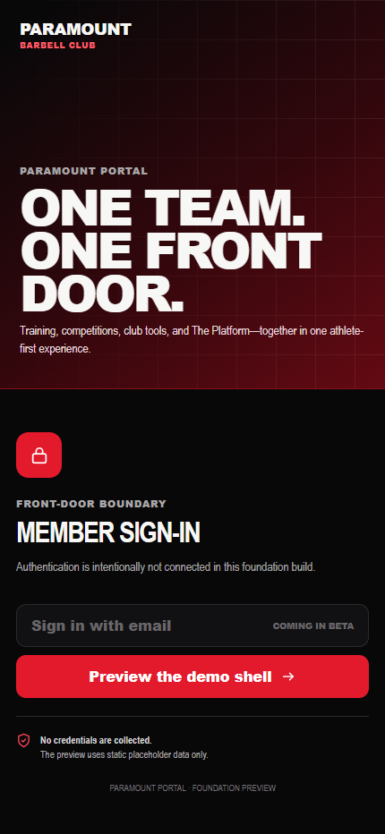

The sign-in screen establishes the intended entry experience. Authentication is not connected, and the demo does not collect credentials.

<strong>Explore the desktop layouts</strong>

### Home

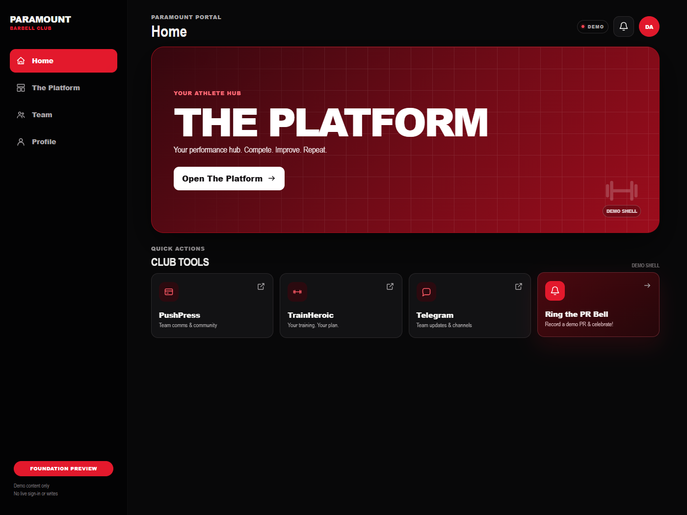

### Athlete profile

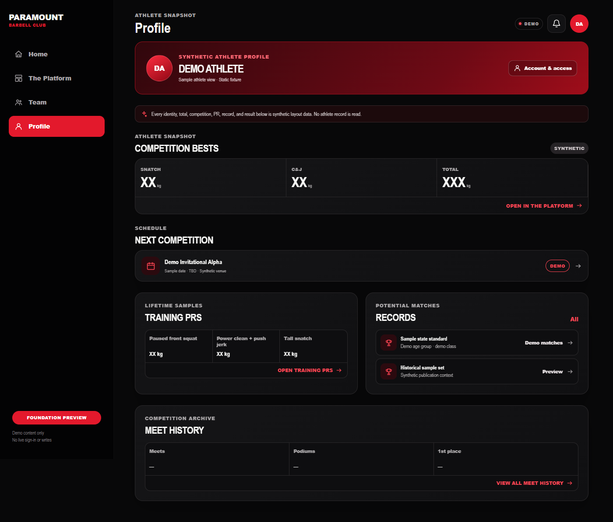

## Current status

| Component | Status |
| --- | --- |
| PWA shell, design, and navigation | **Built** — responsive mobile and desktop surfaces, app manifest, and offline shell foundation. |
| Synthetic preview | **Built** — static demo content, with no live athlete reads or writes. |
| Protected live-data and authentication layer | **Staged / next phase** — the preview is not connected to live data or authentication. |
| Records In Reach presentation | **Built for review** — athlete and coach category presentations are fixture-backed; live Airtable/API integration is not connected. |
| External launchers and PR Bell submission | **Placeholder / concept** — reviewed destinations and authorized persistence remain future work. |

This showcase is a design and architecture review. It is not the production Paramount Portal and has no live Airtable/API or authenticated application access.
